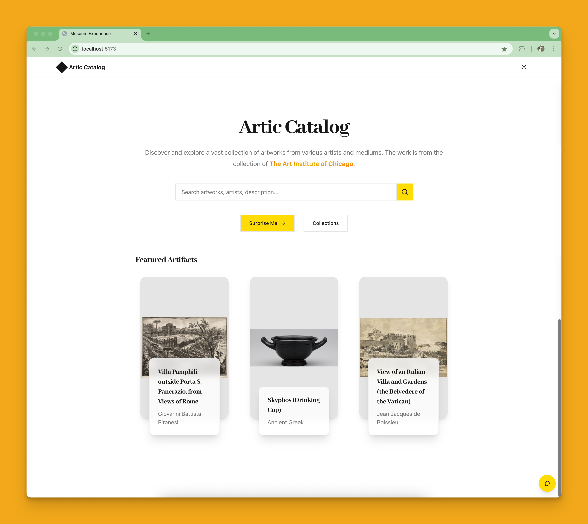
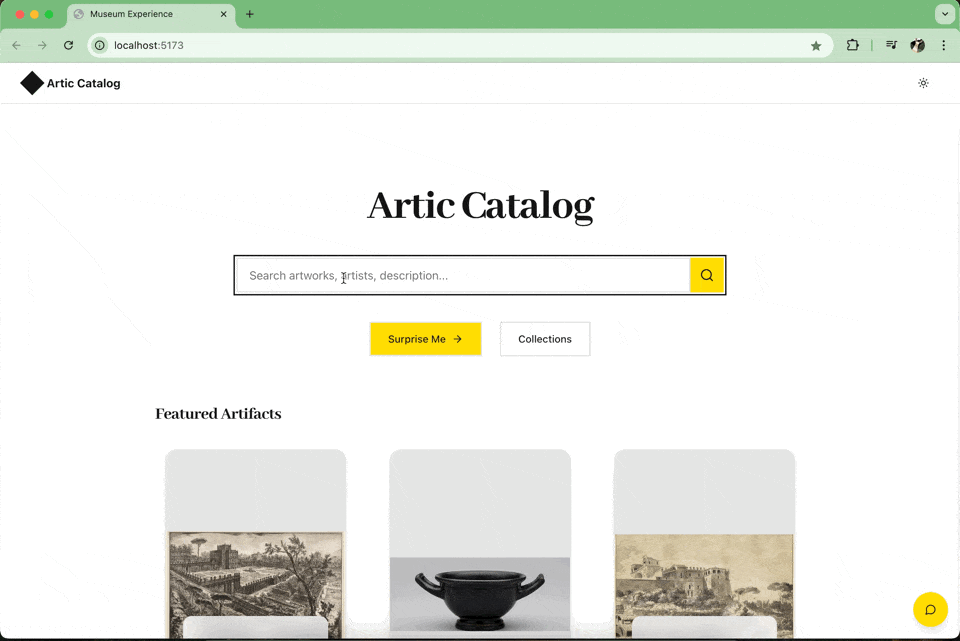

# [WIP] artic-catalog

This artic-catalog is a web application for viewing the artwork collection of the [Art Institute of Chicago](https://www.artic.edu).

<div align="center">
  
  <p><em>Artic Catalog Preview</em></p>

</div>

## Objective

The objective of this project is to create an interactive experience for exploring the Art Institute of Chicago's collection through a modern web interface and an AI-powered chat assistant.

## Features

-   Browse the extensive artwork collection
-   Art Institute Assistant: An AI-powered chat interface for artwork discovery and information
-   Detailed artwork information and high-resolution images

<div align="center">
  
  <p><em>Artic Catalog Search</em></p>
</div>

<div align="center">
  
  <p><em>Artic Catalog Assistant</em></p>
</div>

## Technical Stack

-   Frontend: React with TypeScript
-   Styling: Tailwind CSS
-   Build Tool: Vite
-   AI Integration: Custom chat implementation

## Getting Started

### Prerequisites

-   Node.js (v18 or higher)
-   npm or yarn

### Local Setup

1. Clone the repository

```bash
git clone https://github.com/yourusername/artic-catalog.git
cd artic-catalog
```

2. Install dependencies

```bash
npm install
# or
yarn install
```

3. Create a `.env` file in the root directory

```bash
cp .env.example .env
```

4. Start the development server

```bash
npm run dev
# or
yarn dev
```

The application will be available at `http://localhost:5173`

### Using the Art Institute Assistant

Once the server is running, the AI chat assistant will be available in the application interface. You can interact with it to:

-   Search for artworks
-   Get artwork details
-   Discover related pieces
